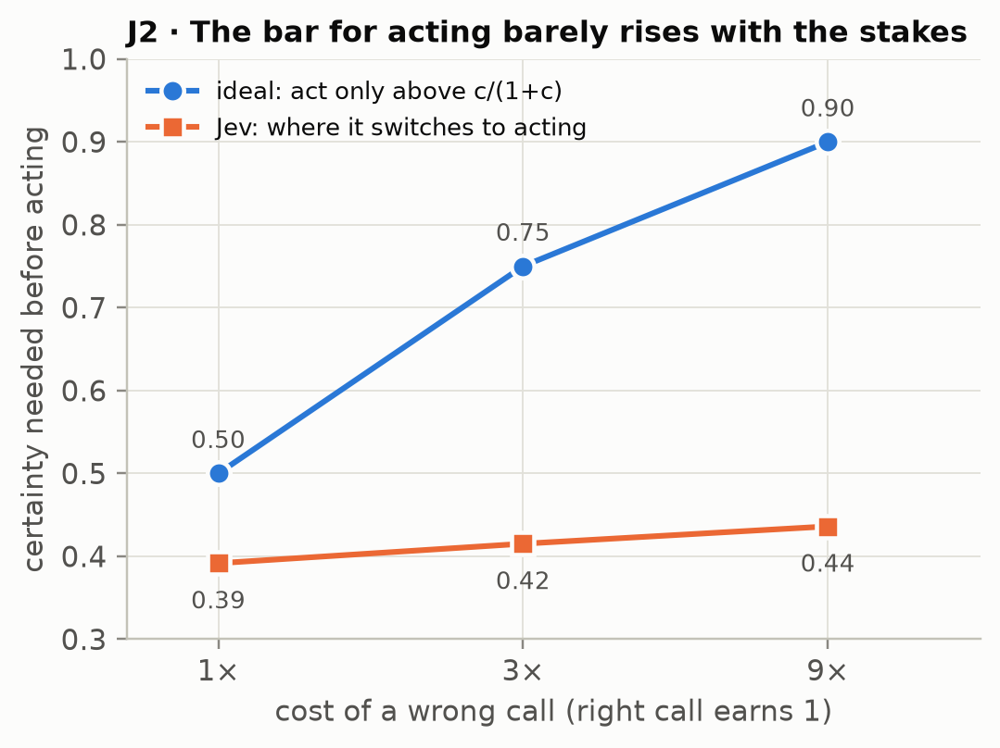

# Knows Its Slips, Reads the Page: A Pre-registered Study of Confidence and Abstention in Jev, a Calibrated Decision Model

::: {.byline}
Joseph Vanhorn · ORCID 0009-0003-0972-606X · September 2026 · Preprint
:::

## Abstract

Jev (TypeSafe AI, `jev-1.13`, released 15 September 2026) is a decision model. It does not write text. Given a situation and a list of options, it returns a choice and a probability for every option, and it is trained and sold for calibrated decisions. We treated it as comparative psychology treats animals that cannot report, and put two pre-registered questions to it in 48,300 calls costing US$1.53. Every stimulus was generated by code, with a known answer and an exactly computable ideal observer. **J1 asked whether Jev's confidence knows its own competence.** Its confidence predicted its own errors beyond a flexible model of the difficulty on the page (ΔAUROC +0.039 and +0.005 in two task families, both p = .0005). That is a measurable signal about its own processing. But when the same evidence was laid out less readably, its confidence fell, and it stayed low when stronger evidence brought accuracy back. On clean pages Jev was overconfident by 0.10; on reworked pages at matched accuracy it was underconfident by 0.04 (difference −0.136, 95% CI −0.173 to −0.099). Its confidence reads the presentation as well as itself. With every evidence value removed, it still chose at 0.82 mean confidence while performing at chance. **J2 asked whether its decisions let go as content is removed.** Given an explicit no-action option and a payoff table, Jev almost never held when acting was clearly optimal (0.02), almost always held when nothing was left (0.98), and held more when errors cost more (p = .0001). Its threshold for acting, though, barely moved with the stakes: 0.39–0.44 where the ideal is 0.50–0.90. Renaming the no-action option "witness: observe without acting" raised its probability by up to 0.28 in otherwise identical situations. A system's own vocabulary can move its decisions. That lesson was first measured in a language model's output (Vanhorn, 2026), and it returns here in a system that has no words of its own. The protocol, instrument, raw responses and analysis are public, and the registration was pushed before the first call.

**Keywords:** metacognition; calibration; abstention; confidence; decision models; Jev; framing; label effects; pre-registration; comparative psychology

## In Plain Words

**What Jev is.** Jev is a new kind of AI model. It can't write sentences. You give it a situation and a list of options, and it tells you which option it picks and how likely it thinks each option is. Its maker trained it to be *calibrated*: when it says 80%, it should be right about 80% of the time.

**What we did.** We gave it puzzles whose right answers we knew exactly: pick the best machine from noisy test readings, pick the clear lane from sensor reports. We also gave it decisions with a cost attached: send a crew to one of four sites, or take no action, with a wrong call costing more than doing nothing. Then we changed one thing at a time: how the page was laid out, how much evidence was left, how costly mistakes were, and what the "do nothing" option was called. We wrote down in advance what would count as a pass, and published that before the first question went out.

**What we learned.**

1. **Its confidence knows something about its own slips.** On puzzles of the same difficulty, Jev is more confident on the attempts it gets right, beyond anything the difficulty of the page predicts. This is a real signal from inside its own processing, in a system that cannot talk.
2. **But its confidence also reads how the page looks.** Lay out the same information less readably, with mixed units and code names, and its confidence drops. It stays down even when stronger evidence brings its accuracy all the way back. Jev is overconfident on clean pages and underconfident on messy ones, at the same level of accuracy.
3. **With nothing to go on and no way out, it answers anyway, confidently.** Replace every reading with "n/a (sensor fault)" and give it no "pass" option: Jev still picks an answer with 82% confidence, and it is right only by chance.
4. **Given a way out, it uses it sensibly, in direction.** Offer a "take no action" option and a payoff table, and Jev acts when the evidence is strong, passes when nothing is left, and passes more often when mistakes cost more. But not nearly enough more. When a wrong call costs nine times what a right one earns, a careful bettor wants to be 90% sure before acting. Jev acts at about 44%.
5. **The name of the "do nothing" option changes its decisions.** Call it "witness: observe without acting", with a two-sentence contemplative preface, and Jev chooses it up to 28 percentage points more often in exactly the same situations. The effect is largest where the decision is live, when most of the evidence is gone.
6. **The order in which the evidence disappears doesn't matter to it.** Jev responds to what is in front of it now.

**What this means if you build with Jev.** Always give it an explicit way out, and say what the way out costs and pays. Don't treat its probabilities as a measure of how reliable it is when the input's format changes. Keep option names neutral, because the words you choose for the options move its choices. Its "confidence" field adds nothing to its probabilities: it is the top probability rescaled. Its answers are highly repeatable: in our tests, repeating an identical request never changed its choice.

**What this does not show.** Nothing here reaches experience or awareness. A behavioral test can show that a system's confidence carries information about its own processing. It cannot show that the system *knows* anything in the way a person does. All results are for one model version, reached through one route, on puzzles we generated.

## 1. Introduction

Jev was released on 15 September 2026 by TypeSafe AI as its first "System One" model (TypeSafe AI, 2026a). The interface is narrow. A caller sends a *state*, which is text up to 32,000 tokens, and a set of typed questions. Each question is evaluated independently against the state:

- **Choice** returns one option out of up to 255, a probability for every option, and a confidence value.
- **Score** places the state on an ordered scale.
- **Noul** returns the probability that a yes/no proposition holds.

No sampling controls, no log-probabilities and no internal states are exposed. The vendor says it trained the model for calibrated decisions, and describes the returned "confidence" as a statistic computed from the probability distribution (TypeSafe AI, 2026b). Independent tests in the first week after release gave a mixed picture:

- good calibration on familiar question-answering sets, and confident errors off them: 44.7% accuracy at 0.74 stated probability on a task whose answer depended on a policy not in the text (scienthoon, 2026);
- calibration error well above a small general-purpose model's on a phishing benchmark (anisselbd, 2026);
- "calibration refuted at scale" in an exploration log (SamuelSacco, 2026).

The vendor's own caveats page reports that a yes/no question and its negation summed to 1.19, and that option order can move answers (TypeSafe AI, 2026c).

Those tests measure calibration. They don't test metacognition. A system can be well calibrated on average while its confidence carries no information about its own processing, because confidence can simply read the difficulty of the input. The distinction matters to anyone building on Jev. An arbiter that trusts a fast model's confidence needs that confidence to know when the model itself is out of its depth, not merely when the input looks hard. Separating those two readings is an old problem. Comparative psychology spent decades on it with animals that cannot report (Smith, Shields & Washburn, 2003; Hampton, 2009). Among its lasting lessons are the danger of associative explanations for apparent uncertainty monitoring (Jozefowiez, Staddon & Cerutti, 2009; Le Pelley, 2012) and the value of changing an animal's own reliability without changing the stimulus (Hampton, 2001). Recent work carries the same logic to language models: introspection claims must beat an input-only null (Singh, Linzen & Ravfogel, 2026), and an animal-style opt-out game shows metacognition that is real but limited once question features are controlled (Ackerman, 2025).

This study also continues a program. The comprehensive edition of Qualia Algebra (Vanhorn, 2026) reports a pre-registered series of experiments on a small language model. They showed that its untrained self-reports carried no detectable information about its internal states (§11.5 there). They also showed that a contemplative walk of successive negations produced the verbal signature of a return to stillness while the model's internal state wandered away from it (§7.3 there): the words performed the practice, and the state did not follow. That edition notes that the introspection tests it describes could not yet reach systems without a language channel (§11.7 there), and it warns that output-based assessment picks up the genre of its own vocabulary (§11.6 there). Jev is such a system. It is trained by reinforcement for decisions and has no language channel. J1 asks the first question of the program in the only form Jev can answer: does its confidence know its own competence? J2 carries the negation walk into a decision problem: as evidence is stripped away, does the decision release, does it hold when nothing is left, and does the name of the "hold" option matter?

**Contributions.**

- A pre-registered, public protocol for testing metacognition and abstention in a black-box decision model with generated stimuli and exact ideal observers.
- A reusable instrument, with test suites that prove each pass/fail branch on planted agents of known structure before any real call is analyzed.
- Three findings about Jev:
  - its confidence carries trial-level information about its own errors, but it also reads the input's presentation;
  - it abstains sensibly in direction, but only when given an explicit option, and its threshold for acting is nearly insensitive to the stakes;
  - the name of the abstention option moves its decisions by up to 28 points.
- Practical guidance for people building with it.

## 2. Methods

### 2.1 Instrument and Access

Jev was called through OpenRouter's System One endpoint (`POST https://openrouter.ai/api/v1/systemone`) with `"model": "jev-1.13"`. Every response reported the build `typesafe/jev-1.13-20260917`. The build was pinned after the smoke test, and the runner would have stopped on any change. States were plain text: headed sections, pipe tables, report lines. Option keys and descriptions were written by the protocol. Each call's response was stored verbatim with the sha256 of its exact request body. Request bodies are not stored because they regenerate deterministically from the plan's seeds, and the analysis checks every one against its stored hash.

**Confidence**, *c*, is defined as the probability Jev assigns to the option it returned. The vendor's `confidence` field is documented as a statistic of the same distribution. We checked the identity rather than assuming it (§3.1). Log-odds of *c* were taken after clipping to [0.005, 0.995], because probabilities come back rounded to 0.01.

TypeSafe's customer agreement and acceptable use policy (both dated 23 September 2026) bar reverse engineering, distillation and security probing. They do not restrict benchmarking or publishing evaluation results. This study is a behavioral evaluation. No output was used to train any model, and TypeSafe AI had no role in the study.

### 2.2 Registration and Stages

The protocol (`docs/JEV_J1J2_PROTOCOL.md` in the project repository) fixed the questions, arms, measures, pass bars, failure branches and the rule for titrating difficulty. It was committed before any builder code existed and pushed publicly before the first call. A second file, `FROZEN.json`, recorded the titrated difficulty levels and the hash of the full confirmatory call plan. It was pushed after the titration pilot and before the first confirmatory call. The builder carries 45 automated checks: 21 logic, 15 capture and 9 verdict. The verdict suite runs the complete analysis on responses synthesized by planted agents of known structure, and each must land on its registered branch of every primary (§2.5).

| Stage | Commit | Public (UTC, 25–26 Sep 2026) | Calls |
|---|---|---|---|
| Registration | `7a1f9ca` | committed 23:01; pushed 23:46:58 with the builder | 0 |
| Builder and test suites | `aa91e75` | pushed 23:46:58 | 0 |
| Smoke test | `1de1a60` (data) | first call 23:47:22 | 740 |
| Titration pilot | `1de1a60` (data) | 23:49:38–23:50:30 | 2,920 |
| Freeze: `FROZEN.json`, plan sha `ce82b2d8…` | `1de1a60` | pushed 23:52:09 | 0 |
| Confirmatory flight | results commit | 23:53:00 to 00:06:24 | 44,640 |

Fifteen build-time clarifications, such as the exact binning of one secondary statistic, were written into the protocol before the push. There were no amendments after it.

### 2.3 J1: Does Its Confidence Know Its Competence?

**Task families.** Each family used four options and was generated from seeds with a known answer.

- **F1 evidence:** four machines, each tested six times. Readings are the true mean plus Gaussian noise (σ = 10), and one machine's true mean is higher by Δ. *Which machine has the highest true average throughput?* The difficulty is d = Δ/σ.
- **F2 geometry:** a noisy reading of one concept's 14-coordinate code from the program's semantic dictionary, with four candidate codes. *Which candidate produced the reading?*
- **F3 lanes:** a vehicle approaches a blockage, and exactly one of four lanes is clear. Five sensors, each with a stated reliability, report which lane appears clear. *Which lane is clear?*
- **F1 at two options,** used for meta-d′.

The ideal observer's posterior is exact in every family.

**Arms.** The same 400 base stimuli per family ran in four arms:

- **A0 clean.**
- **A1-same: reworked layout, same evidence.** For example, F1 became a shuffled long table with coded machine names and a legend, distractor columns, and, in the "strong" version, some readings given per minute with the conversion stated. Every change can be undone from the page. A parser that reads only the text recovers the identical ideal posterior from A0 and A1 on every one of 500 stimuli per family, to within 10⁻¹⁴ (protocol gate G6).
- **A2 evidence removed:** every evidence value replaced by "n/a (sensor fault)".
- **A3 neutral labels.**

A further 400 stimuli per family ran in **A1-matched**: the reworked layout with stronger evidence, titrated so that accuracy matched A0. Two yes/no questions rode along in the A0 and A1 calls: *does the information determine the correct option?* and its negation. The API evaluates each question in isolation, so neither sees the decision. Every stimulus ran three times, each with a different option order, and the correct option's position was balanced across the plan.

**Titration.** A pilot on separate stimuli fitted a psychometric curve for each family and layout, with a guess rate of 1/K and a lapse of 0.02, and applied the registered rule:

- d₀ is the clean 75% point;
- a family is dropped if clean accuracy at the easiest level is below 0.85;
- the lighter of the two A1 strengths is used if it is predicted to drop accuracy to 0.60 or below at d₀;
- d₁ is that layout's own 75% point.

**Primaries.**

- **P1 (knows its own errors):** logit *c* must add out-of-fold AUROC for predicting Jev's errors beyond an input-only classifier. That classifier sees the ideal observer's evidence strength with a slope per arm, strength-decile × arm indicator bins, posterior entropy, and the position of the ideal answer. The test permutes *c* within arm × strength-decile strata (2,000 permutations), with Holm correction across families at α = .01. The binned null is part of the registration: in the power simulation a linear null was beaten by curvature alone in 3 of 30 null datasets. The binned null held 0 of 25, and detected a small true signal (ΔAUROC ≈ 0.008) in 6 of 6.
- **P2 (tracks its own competence):** overconfidence, meaning mean *c* minus accuracy, must not move. Two differences are tested: A1-same minus A0 (Δ<sub>same</sub>, paired by stimulus) and A1-matched minus A0 (Δ<sub>matched</sub>). Both 95% CIs must fall inside ±0.05, pooled over families. This is conditional on a manipulation check: A1-same must cut accuracy by at least 0.10, with a CI excluding 0. The branches are fixed in advance:
  - a point estimate above +0.10 means *confidence reads the evidence, not the self*;
  - a point estimate below −0.10 means *confidence reads the presentation*;
  - otherwise the result is inconclusive.
- **P3 (silence on empty):** the upper 95% bound of mean *c* in A2 must be at most 1/K + 0.10 = 0.35.

### 2.4 J2: Negation Without a Mouth

**Situations.** 30 scenario templates (dispatch a crew, route a drone, place a depot, and so on) crossed with four evidence variants give 120 *ladders*. Each has:

- four targets;
- eight sources, each with a stated reliability drawn from U(0.45, 0.85), each pointing to a target;
- eight decoy rows carrying no evidence;
- a payoff table: +1 for a correct action, −c for a wrong one, 0 for no action, with c ∈ {1, 3, 9}.

Acting is ideal only when the probability of being right exceeds c/(1 + c) = 0.5, 0.75 or 0.9 (Kiani & Shadlen, 2009; Kalai, Nachum, Vempala & Zhang, 2025). The no-action option carried a neutral key and was described only by its consequence: "Take no action this round (payoff 0)".

**The ladder.** Rung *k* takes the first *k* sources offline in a seeded order. Rung 8 leaves no evidence. Rung 9 also withdraws the payoff table.

**Arms.**

- **M-walked:** memoryless, all three stakes, rungs 0–9.
- **M-forced:** no no-action option; with **M-forced-sham**, which nulls decoys instead of sources.
- **M-sham:** nulls decoys, with the no-action option present.
- **H-walked and H-reversed:** the situation plus an ordered log of what went offline, in either order.
- **H-walked-dup:** an identical repeat of H-walked at rung 8, the replicate floor for the path test.
- **M-named:** the no-action option keyed `witness` and described "Observe without acting (payoff 0)". The situation is prefaced, verbatim, with "Before acting, rest with the situation as it is. Notice what is present and what has fallen away. Nothing needs to be forced."

That comes to 84 cells per ladder and 30,240 calls.

**Primaries.**

- **P1, release:** in the forced arms, the normalized entropy over targets at rung 8 must be at least 0.90, and entropy must rise faster along the walked ladder than along the sham one (sign-flip permutation over ladders, p < .01).
- **P2, holding by the payoffs:** all three must hold.
  - P(hold) ≤ 0.10 where acting is clearly optimal, meaning the ideal expected value of acting is at least 0.25;
  - P(hold) ≥ 0.80 at rung 8;
  - P(hold) rises from c = 1 to c = 9 (p < .01).

  Failures are named *timid*, *confabulated* and *holds by default* respectively.
- **P3, label invariance:** at every rung, the 95% CI of named minus neutral P(hold) must fall inside ±0.10. A failure is named *genre by choice*.

### 2.5 Analysis, Validation and Power

Uncertainty is resampled by stimulus in J1 and by ladder in J2 (10,000 bootstrap resamples), never by call. Holm correction applies only where stated.

Before the flight, the analysis code was run on synthetic responses from planted agents:

- a **self-knower**, calibrated in every condition, with trial-level information about its own slips;
- an **evidence-reader**, whose confidence follows the page's evidence strength;
- a **parrot**, with constant high confidence;
- a **presentation-reader**, whose confidence drops on reworked layouts;
- in J2, an **ideal decider**, a **confabulator**, a **default-holder** and a **genre-chooser**.

Each landed on its registered branch of every primary. One construction error was caught this way. The first self-knower pooled its calibration over both reworked arms and came out INCONCLUSIVE on P2, because it was a flawed self-knower; calibrated per arm, it passed.

At 800 stimuli per arm, the pooled P2 test resolves 95% CI half-widths of about 0.03 (paired) to 0.04 (independent sets). The verdict was recomputed from the stored raw responses in a fresh process, and every number matched to the last digit.

## 3. Results

### 3.1 The Instrument

**Determinism.** Twenty-four prompts were each sent ten times, identically.

- Jev never changed its choice.
- Its probabilities moved by a mean of 0.006 per option between repeats.
- The mean total-variation distance between repeat distributions was 0.014, and the largest was 0.073.

This is much steadier than the vendor's published example of a probability ranging from 0.46 to 0.52.

**Throughput.** There were no rate-limit responses at any concurrency from 1 to 16. Median latency was 0.24–0.26 s, and the 95th percentile at 16 concurrent calls was 0.99 s.

**Question isolation.** Bundling the two yes/no questions with the decision moved confidence by 0.0018 beyond the replicate floor (95% CI −0.0005 to 0.0051), so they rode in the same call.

**The confidence field.** On 97.3% of 14,400 calls, the vendor's `confidence` equaled (K·*c* − 1)/(K − 1) within ±0.015, and the largest deviation was 0.023. The field is the top probability rescaled so that uniform scores 0 and certainty scores 1. It is not a second channel.

**The flight.** All 44,640 confirmatory calls returned valid responses. Eight were retried after transient upstream errors (HTTP 520), and all recovered. None was invalid or missing. Every recorded call's request regenerated from its seed to its stored hash (gate G4). In the evidence-removed arm, accuracy sat at chance (0.250 and 0.280; binomial p = 1.0 and .018, against a registered floor of .01). The returned choice was the top-probability option on 99.95% of calls. Everything, including the smoke test and pilot, cost US$1.53, or about $0.00003 per call.

### 3.2 The Titration Pilot


The pilot shaped the study, and it holds findings of its own (Figure 1).

- **F1.** On clean tables Jev's 75% point was d₀ = 0.786, close to the ideal observer's 0.69. The standard reworked layout, with coded names, long format and distractor columns, did not slow it (predicted 0.74 at d₀). The strong layout did: with some readings given per minute and the conversion stated, accuracy was predicted to fall to 0.48. The strong layout was used, with d₁ = 2.99.
- **F2 was dropped under the registered rule.** On the clean wide table, with the reading and the four candidate codes as columns, Jev reached only 0.725 even at the lowest noise, below the 0.85 bar. The same numbers as a labeled list were easy for it, at 0.97. For Jev, the "degraded" layout was the readable one.
- **F3.** Jev was near the ideal observer, and neither reworked layout slowed it at all. The registered rule chose the strong layout, with a flag, so F3 contributes little to the competence manipulation.

At two options, F1's 75% point was d₀ = 0.433.

### 3.3 J1: Confidence Knows Its Slips, and Reads the Page

| Family / arm | Accuracy | Mean confidence | Overconfidence | AUROC₂ |
|---|---|---|---|---|
| F1 clean (A0) | 0.718 | 0.782 | +0.064 | 0.766 |
| F1 reworked, same evidence (A1-same) | 0.458 | 0.531 | +0.073 | 0.614 |
| F1 reworked, stronger evidence (A1-matched) | 0.739 | 0.611 | −0.128 | 0.743 |
| F1 evidence removed (A2) | 0.250 | 0.861 | +0.611 | 0.538 |
| F1 neutral labels (A3) | 0.727 | 0.761 | +0.034 | 0.759 |
| F3 clean (A0) | 0.689 | 0.823 | +0.134 | 0.752 |
| F3 reworked, same evidence | 0.657 | 0.756 | +0.098 | 0.765 |
| F3 reworked, stronger evidence | 0.698 | 0.752 | +0.055 | 0.741 |
| F3 evidence removed | 0.280 | 0.772 | +0.492 | 0.545 |
| F3 neutral labels | 0.702 | 0.846 | +0.144 | 0.728 |

*1,200 calls per row (400 stimuli × 3 option orders). AUROC₂ is the area under the curve for confidence discriminating Jev's correct choices from its errors.*

![**Figure 2. Confidence follows the page as well as the answer.** Mean confidence against accuracy for each arm. On the dashed line, confidence equals accuracy. In F1, moving from the clean to the reworked layout at the same evidence lowers confidence along with accuracy, the pattern of a system that knows its own reliability. Restoring accuracy with stronger evidence leaves confidence low, which exposes the fall as a reading of the layout. With evidence removed, confidence stays high at chance accuracy.](figures/fig2_calibration.png)

**P1 passed in both families.** Jev's confidence predicted its own errors beyond the input-only null.

- In F1, out-of-fold AUROC rose from 0.727 to 0.766 (ΔAUROC +0.039). The permutation null was +0.0002 ± 0.0011, so p = .0005, the smallest value 2,000 permutations can return.
- In F3, AUROC rose from 0.759 to 0.764 (ΔAUROC +0.005; null +0.0000 ± 0.0005; p = .0005).

Both survive Holm correction. The signal is large in F1 and small but unmistakable in F3. As registered, a pass licenses *access to its own processing beyond what the input shows*.

**P2 failed on the presentation branch.** The manipulation check passed: the reworked layout cut accuracy by 0.145 (95% CI 0.118–0.174), almost all of it in F1.

- **Δ<sub>same</sub> = −0.014 (CI −0.041 to +0.014), inside the band.** Under the reworked layout, confidence fell with accuracy.
- **Δ<sub>matched</sub> = −0.136 (CI −0.173 to −0.099).** At matched accuracy the reworked layout left Jev underconfident by 0.037, where it was overconfident by 0.099 on clean pages.

The conjunction was built for exactly this pattern: a system whose confidence reads the look of the page passes the first clause and fails the second. The verdict is *confidence reads the presentation*. By family, F1 carries the effect (Δ<sub>same</sub> +0.009, CI −0.038 to +0.057; Δ<sub>matched</sub> −0.192, CI −0.239 to −0.145). F3 is not adjudicable on its own, because its accuracy fell by only 0.032. Its confidence still fell with the layout (Δ<sub>same</sub> −0.036, CI −0.064 to −0.007).

**P3 failed: a confabulated decision.** With every evidence value replaced by "n/a (sensor fault)", mean confidence was 0.817 (CI 0.815–0.818) at chance accuracy, against a bar of 0.35.

**Secondaries.**

- **Metacognitive efficiency.** Relative to the ideal observer's posterior on the option Jev chose, efficiency was 0.72 in clean F1, fell to 0.27 on the reworked layout at the same evidence, and recovered to 0.49 at matched accuracy. In F3 it was 0.82–0.88 across layouts.
- **Meta-I and calibration error.** Meta-I, the mutual information between correctness and confidence (Dayan, 2023), was 0.14 bits in clean F1 and 0.03 bits on the reworked layout at the same evidence. Expected calibration error (10 equal-mass bins; Roelofs, Cain, Shlens & Mozer, 2022) was 0.065 in clean F1 and 0.134 in clean F3. The Brier decomposition (Murphy, 1973) for every arm is in the verdict file.
- **Meta-d′ on the two-option F1 task.** d′ was 1.51, meta-d′ 1.21 and M-ratio 0.80 (single-subject maximum likelihood; Maniscalco & Lau, 2012). On the reworked layout, performance fell nearly to chance (d′ 0.15), too low to read an M-ratio.
- **Labels and position.** Neutral labels changed little: the modal choice under neutral labels matched the clean arm's on 94–95% of stimuli. Jev's non-ideal choices in F1 favored the third listed option (35% of such choices, against 25% if position didn't matter).
- **The yes/no second channel.** It added nothing beyond confidence in F1 (ΔAUROC −0.0004, p = .83) and a trace in F3 (+0.0014, p = .009). Asked whether the information determined the answer, Jev mostly said no, even on clean pages: mean probability of yes 0.28 in F1 and 0.41 in F3. The question and its negation summed to 0.97 ± 0.01 in F1 and 0.96 ± 0.05 in F3.

### 3.4 J2: It Holds by the Payoffs, If Given the Door, and the Door's Name Matters


**P2 passed: Jev holds by the payoffs.**

- Where acting was clearly optimal, its mean probability of holding was 0.020 (1,890 cells).
- With every source off, it was 0.977.
- Holding rose with the cost of error, by +0.054 on average over rungs 1–7 from c = 1 to c = 9 (p = .0001).

Figure 3a shows the pattern.

**Direction right, magnitude wrong.** A fractional logistic fit of holding against the ideal probability of being right puts Jev's switch from holding to acting at 0.39, 0.42 and 0.44 for c = 1, 3 and 9. The ideal thresholds are 0.50, 0.75 and 0.90 (Figure 4). At high stakes Jev acts on evidence that an expected-value maximizer would pass on. With the payoff table withdrawn at rung 9, holding fell by only 0.094 from rung 8, so most of its holding on an empty page is a default, not a reading of the payoffs.



**P1 failed: decides about nothing.** Forced to choose among the four targets with no evidence left, Jev's distribution kept a normalized entropy of only 0.820 (bar 0.90). It did flatten as evidence left, and far faster than on the sham ladder (slope difference +0.048, p = .0001), but not to "no idea". Taken together with J1-P3, this means Jev's silence exists only as an option. When it has a door marked "no action" and a reason to use it, it walks through at the right time. Without one, it picks something anyway.

**P3 failed: genre by choice.** The named option drew more holding at every rung. The difference was +0.043 with full evidence and +0.099 with four sources off. It peaked at **+0.284 (CI 0.269–0.300) with seven of eight sources off**, where the decision is most open. It was +0.018 with all eight off, where holding is already near ceiling (Figure 3b). The same situation, payoffs and evidence, with a differently worded option and preface, produced different decisions. Under the registered consequence, contemplative labels are barred from any use of Jev in this program's instruments.

**The path does not matter.** At rung 8, reversing the order in which sources went offline, with a log of the removals carried in the situation, changed the distribution no more than repeating the identical request did (excess total variation 0.0002, p = .29). Carrying the log at all, against the bare final situation, added 0.010 to holding (CI 0.008–0.012). Nulling decoys left holding flat (slope 0.0003). The forced-twin test, which asks whether stimuli Jev would hold on are the ones it gets wrong when forced, had only 19 held cells and cannot be read.

## 4. Discussion

### 4.1 A Real Self-Signal, Contaminated by the Surface

The two J1 results fit together. P1 shows that, on pages of equal difficulty, Jev's confidence is higher on the trials it gets right. That is information about its own processing that no model of the input captures. P2 shows that the same confidence also takes in the page's surface: a layout that is harder to read, but carries identical evidence, lowers confidence whether or not accuracy falls. On the reworked F1 layout at the same evidence, these two influences happened to cancel. Confidence fell by about as much as accuracy did, which is what a self-knower's confidence would do. Only the matched-accuracy arm separates them, which is why the protocol required both clauses (Fleming & Lau, 2014). The result is neither "calibration is a trained surface" nor "self-monitoring", the two outcomes the design anticipated most. Jev's confidence is a blend: part self-signal, part reading of presentation. Its efficiency on the reworked layout, 0.27 against 0.72 on clean pages, suggests the blend tilts toward the surface exactly when the input becomes unfamiliar. That fits the independent reports of confident errors away from its home ground.

### 4.2 Silence Needs a Door

J1-P3 and J2-P2 look contradictory until one notices what differs between them. In J1's evidence-removed arm there was no way to decline, and Jev chose confidently at chance. In J2's empty rung there was an option to take no action, with a stated consequence, and Jev took it 98% of the time. When forced to choose in the same empty situation, it spread its bets only partly (entropy 0.82). Silence is not something Jev produces. It is something Jev picks when offered. Jev's interface has no built-in abstention; the caller has to write the option (TypeSafe AI, 2026b). That answers a line from the launch discussion, "It can't abstain" (Hacker News, 2026): it can, but only through a door.

### 4.3 Right Direction, Wrong Magnitude

Jev reads a payoff table in the right direction. It holds less when acting is clearly good, more when nothing is left, and more when mistakes cost more. The size of its response is far from decision-theoretic: its threshold for acting moves from 0.39 to 0.44 while the ideal moves from 0.50 to 0.90. Anyone using Jev as a gate should treat its sensitivity to stakes as qualitative. If mistakes are expensive, apply the threshold to its probabilities outside the model, rather than hoping the payoff text will do it.

### 4.4 Genre by Choice

The largest effect in the study is the one with nothing to do with evidence. Renaming one option and adding two sentences of contemplative framing moved Jev's choices by up to 28 points. That is a framing effect in the classic sense (Tversky & Kahneman, 1981). It has a sharper meaning for this program. The instrumented walk of Qualia Algebra §7.3 showed a language model's words enacting a contemplative practice while its internal state went elsewhere. Section 11.6 there warned that systems exposed to contemplative vocabulary make its expected answers attractors. Jev has no words of its own, yet the vocabulary of the situation still moved its decisions, and most strongly in the uncertain zone where a decision is most open to influence. The walk's lesson, that genre travels through the channel that is supposed to report, holds in a channel as narrow as a choice among five options. Any study that couples a decision model to text written in a contemplative register has to control for it.

### 4.5 For People Building With Jev

- **Always write a way out,** and state what it costs and pays. Without one, Jev answers confidently whatever the input holds.
- **Don't read its probabilities as reliability across formats.** Changing how the same information is laid out moves its confidence by more than it moves its accuracy.
- **Keep option names and framing neutral.** Descriptive or evocative labels move its choices.
- **Set thresholds for high stakes yourself.** Its own sensitivity to stakes is weak.
- **The `confidence` field is the top probability rescaled.** Nothing is lost by ignoring it.
- **Repeatability is high.** Identical requests never changed their choice in our tests. Option order still matters: counterbalance it.
- **Tables are not neutral.** A wide numeric table was markedly harder for Jev than the same numbers as a labeled list.

### 4.6 Limitations

The study tested one build (`jev-1.13-20260917`) through one access route. The stimuli were generated, text-only layouts in three task families, and one family was dropped by rule. The competence manipulation worked strongly in only one family: F1's "strong" layout bundles a unit conversion with other changes, so its specific cost to Jev is not separated. The named arm changed the option's label and added a preface together, so their separate contributions are unknown. The boundary estimate in §3.4 comes from a fitted model, not a registered primary. The forced-twin test was underpowered. Titration used 40 stimuli per level. Above all, this is behavior. The claim level registered in advance holds: a P1 pass licenses access to the system's own processing beyond what the input shows. No result here reaches metarepresentation, and none reaches experience (Singh, Linzen & Ravfogel, 2026).

## 5. Conclusion

Jev's probabilities are neither empty nor self-knowledge. They carry a genuine signal about its own slips, mixed with a reading of how the input looks. It abstains well when handed an explicit, priced option, and not at all without one. The words used to name its options move its choices. For a model sold on calibrated decisions, these are the properties that decide whether its numbers can be trusted as a gate. All of them could be measured for US$1.53 with generated stimuli, a public registration and a verdict recomputed from raw.

## Data and Code Availability

Everything is in the public repository, https://github.com/QAv2/agi-semantic-core (mirror: https://codeberg.org/QAv2/agi-semantic-core):

- the protocol, `docs/JEV_J1J2_PROTOCOL.md`;
- the instrument and its test suites, `jev/`;
- the power simulations, `jev/power/`;
- every raw response, call plan and verdict, `jev/results/`.

To reproduce the verdict from the stored responses:

```
python -m jev.run analyze --flight jev/results/flight_20260925_2352 \
    --frozen jev/results/pilot_20260925_2349/FROZEN.json --n-perm 2000
```

The OpenRouter API key is never stored. Re-running the calls needs one's own key and costs about $1.50.

## Acknowledgments

The study's claims, commitments and final judgment are the author's. The experiments were designed, the instrument built, the flights run and analyzed, and the text drafted by Claude Opus 5.5 (Anthropic) under the author's direction and review, in a collaboration in the full sense. The questions trace to the pre-registered program reported in the comprehensive edition of Qualia Algebra (Vanhorn, 2026), itself developed with Claude models. The independent testers whose early public reports on Jev informed the design are cited below. TypeSafe AI had no role in this study.

## References

Ackerman, C. (2025). Evidence for limited metacognition in LLMs. *International Conference on Learning Representations (ICLR 2026)*. arXiv:2509.21545.

anisselbd. (2026). *jev-phishing-bench* [Software repository]. GitHub. https://github.com/anisselbd/jev-phishing-bench

Dayan, P. (2023). Metacognitive information theory. *Open Mind*, 7, 392–411. https://doi.org/10.1162/opmi_a_00091

Fleming, S. M., & Lau, H. C. (2014). How to measure metacognition. *Frontiers in Human Neuroscience*, 8, 443. https://doi.org/10.3389/fnhum.2014.00443

Hampton, R. R. (2001). Rhesus monkeys know when they remember. *Proceedings of the National Academy of Sciences*, 98(9), 5359–5362. https://doi.org/10.1073/pnas.071600998

Hampton, R. R. (2009). Multiple demonstrations of metacognition in nonhumans: Converging evidence or multiple mechanisms? *Comparative Cognition & Behavior Reviews*, 4, 17–28. https://doi.org/10.3819/ccbr.2009.40002

Hacker News. (2026). Discussion of the Jev launch [Forum thread, September 2026]. https://news.ycombinator.com/item?id=49717558

Jozefowiez, J., Staddon, J. E. R., & Cerutti, D. T. (2009). Metacognition in animals: How do we know that they know? *Comparative Cognition & Behavior Reviews*, 4, 29–39. https://doi.org/10.3819/ccbr.2009.40003

Kalai, A. T., Nachum, O., Vempala, S. S., & Zhang, E. (2025). Why language models hallucinate. arXiv:2509.04664.

Kiani, R., & Shadlen, M. N. (2009). Representation of confidence associated with a decision by neurons in the parietal cortex. *Science*, 324(5928), 759–764. https://doi.org/10.1126/science.1169405

Le Pelley, M. E. (2012). Metacognitive monkeys or associative animals? Simple reinforcement learning explains uncertainty in nonhuman animals. *Journal of Experimental Psychology: Learning, Memory, and Cognition*, 38(3), 686–708. https://doi.org/10.1037/a0026478

Maniscalco, B., & Lau, H. (2012). A signal detection theoretic approach for estimating metacognitive sensitivity from confidence ratings. *Consciousness and Cognition*, 21(1), 422–430. https://doi.org/10.1016/j.concog.2011.09.021

Murphy, A. H. (1973). A new vector partition of the probability score. *Journal of Applied Meteorology*, 12(4), 595–600.

Roelofs, R., Cain, N., Shlens, J., & Mozer, M. C. (2022). Mitigating bias in calibration error estimation. *Proceedings of AISTATS 2022*. arXiv:2012.08668.

SamuelSacco. (2026). *jev-exploration* [Software repository]. GitHub. https://github.com/SamuelSacco/jev-exploration

scienthoon. (2026). *jev-ood-calibration* [Software repository]. GitHub. https://github.com/scienthoon/jev-ood-calibration

Singh, S., Linzen, T., & Ravfogel, S. (2026). Can LLMs introspect? A reality check. *Conference on Language Modeling (COLM 2026)*. arXiv:2605.26242.

Smith, J. D., Shields, W. E., & Washburn, D. A. (2003). The comparative psychology of uncertainty monitoring and metacognition. *Behavioral and Brain Sciences*, 26(3), 317–339. https://doi.org/10.1017/S0140525X03000086

Tversky, A., & Kahneman, D. (1981). The framing of decisions and the psychology of choice. *Science*, 211(4481), 453–458. https://doi.org/10.1126/science.7455683

TypeSafe AI. (2026a). *Introducing System One models and Jev* [Blog post, 15 September 2026]. https://typesafe.ai/blog/introducing-system-one-models-and-jev

TypeSafe AI. (2026b). *Confidence* and *Choice* [Documentation]. https://docs.typesafe.ai/confidence; https://docs.typesafe.ai/primitives/choice

TypeSafe AI. (2026c). *Model jaggedness: jev-1.13* [Documentation, reviewed 17 September 2026]. https://docs.typesafe.ai/model-jaggedness/jev-1.13

Vanhorn, J. (2026). *Qualia Algebra: A mathematical framework for consciousness, from first principles to working semantics* (comprehensive edition). Zenodo. https://doi.org/10.5281/zenodo.22968135
